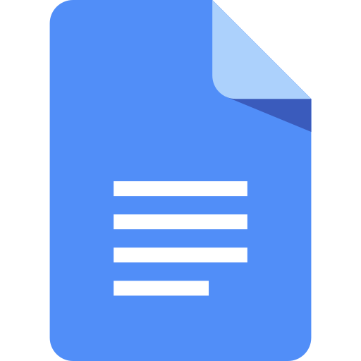
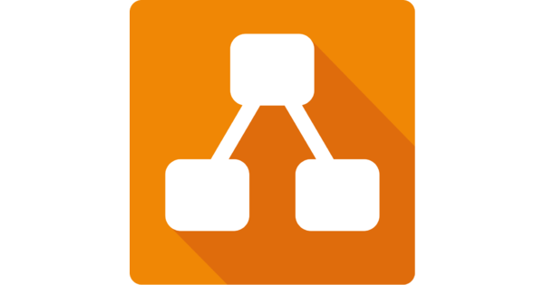
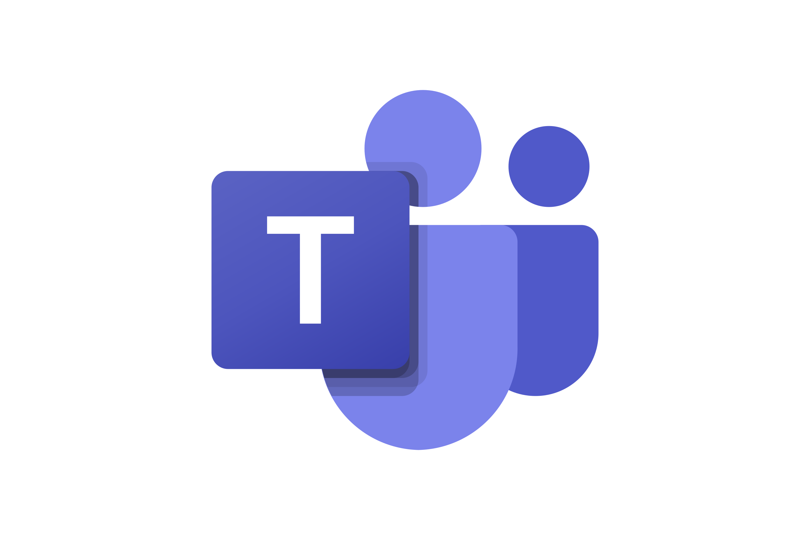
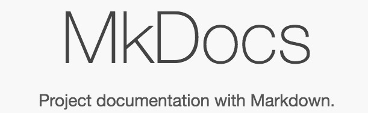
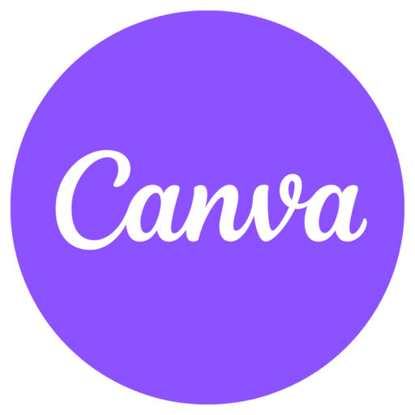
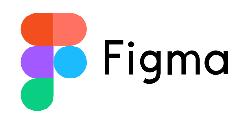
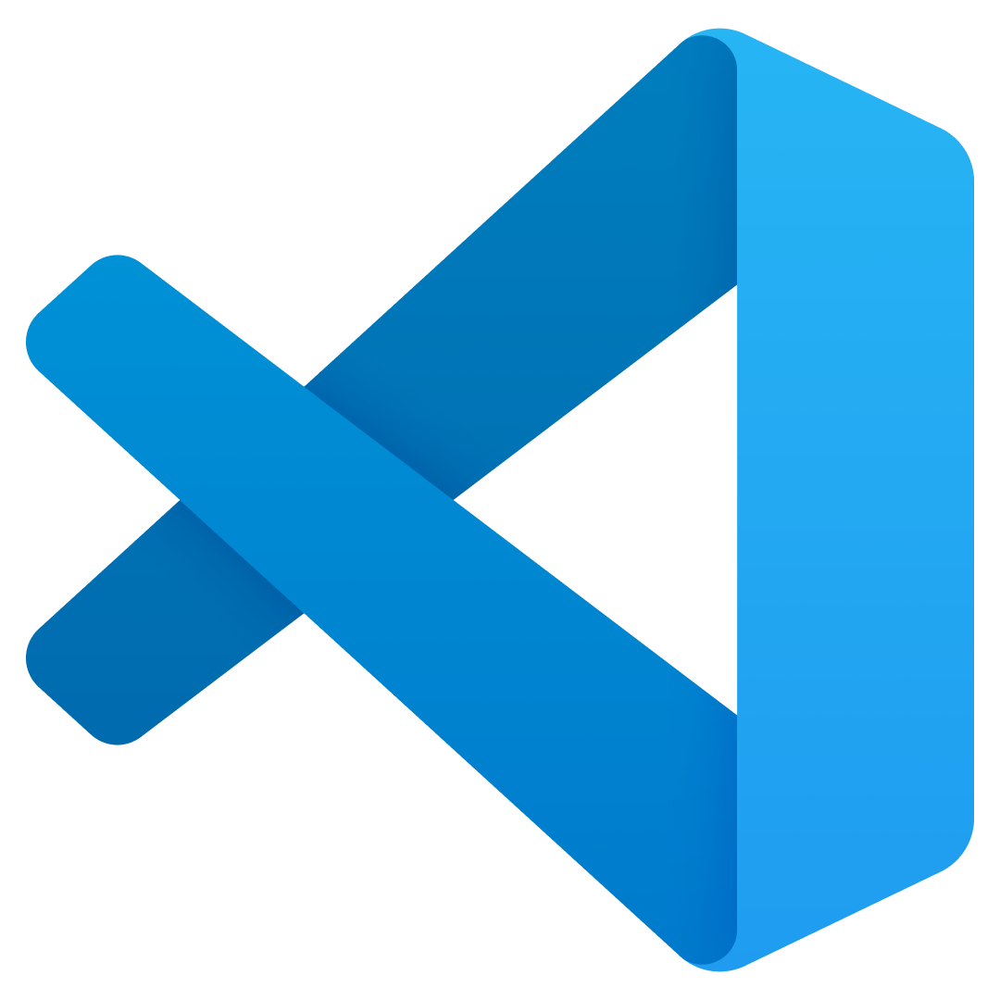
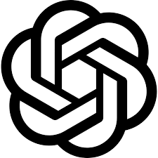
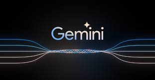

# Ferramentas

Para assegurar a eficiência e promover a colaboração contínua da equipe, nosso projeto conta com diversas ferramentas que otimizam desde a comunicação até o gerenciamento de versões. A _Tabela 1_ apresenta cada uma delas, destacando como se integram para tornar nosso trabalho diário mais ágil e organizado.

|                             Ícone                              |                                                            Ferramenta                                                             | Finalidade                                                            |
| :------------------------------------------------------------: | :-------------------------------------------------------------------------------------------------------------------------------: | :-------------------------------------------------------------------- |
|           { width="90" }           |                                                   [Github](https://github.com/)                                                   | Hospedagem e versionamento do projeto.                                |
|         { width="90" }          |                                   [Google Docs](https://docs.google.com/document/u/0/?hl=pt-BR)                                   | A documentação do projeto é centralizada no Docs.                     |
|         { width="120" }         |                                               [Draw.io](https://app.diagrams.net/)                                                | Elaboração das Rich Pictures e dos Diagramas Entidade-Relacionamento. |
|           { width="120" }            |                           [Teams](https://www.microsoft.com/pt-br/microsoft-teams/group-chat-software)                            | Gravação das apresentações.                                           |
|         { width="90" }         |                                         [WhatsApp](https://www.whatsapp.com/?lang=pt_br)                                          | Comunicação diária entre os integrantes da equipe.                    |                                            
|          { width="120" }           |                                     [Mkdocs](https://www.mkdocs.org/user-guide/installation/)                                     | Criação das páginas de documentação.                                  |
|            { width="90" }            |                                               [Canva](https://www.canva.com/pt_br/)                                               | Criação de apresentações.                                             |
|         { width="90" }          |                                            [Figma](https://www.figma.com/pt-br/sites/)                                            | Criação de representações gráficas.                                   |
|          { width="90" }           |                                         [Vscode](https://code.visualstudio.com/download)                                          | Atualização de documentos do projeto.                                 |
|         { width="90" }         |                                                 [Chat-gpt](https://chatgpt.com/)                                                  | Ferramento de auxílio na resolução de dúvidas.                        |
|         { width="100" }          |                                                [YouTube](https://www.youtube.com/)                                                | Hospedagem dos vídeos produzidos.                                     |
|          { width="110" }           |                                         [Gemini](https://gemini.google.com/app?hl=pt-BR)                                          | Ferramenta de suporte na busca por respostas e soluções.              |

_Tabela 1_: Tabela de Ferramentas utilizadas. Fonte: [Geovanna Alves](https://github.com/GeovannaUmbelino) 

## Agradecimentos

  Queremos agradecer o <b>Gemini e ChatGPT</b>, ferramenta de Inteligência Artificial Generativa, pelo apoio durante o desenvolvimento deste projeto Jornada do Estudante. Sua ajuda foi essencial na revisão de textos, na organização das ideias e na pesquisa de conteúdos complementares que contribuíram para deixar nossa documentação mais clara e completa.

De acordo com o Código de Conduta da Sociedade Brasileira de Computação (SBC), destacamos que a ferramenta foi utilizada apenas como apoio técnico e linguístico.
Todo o conteúdo apresentado é de autoria do Grupo 05, que assume total responsabilidade por sua originalidade e precisão.

## Histórico de Versões

| Versão | Data       | Descrição                                          | Autor                                                 | Revisor                                               |
| ------ | ---------- | -------------------------------------------------- | ----------------------------------------------------- | ----------------------------------------------------- |
| 1.0    | 03/06/2026 | Transcrição da tabela de ferramentas               | [Geovanna Alves](https://github.com/GeovannaUmbelino) |        |
|
