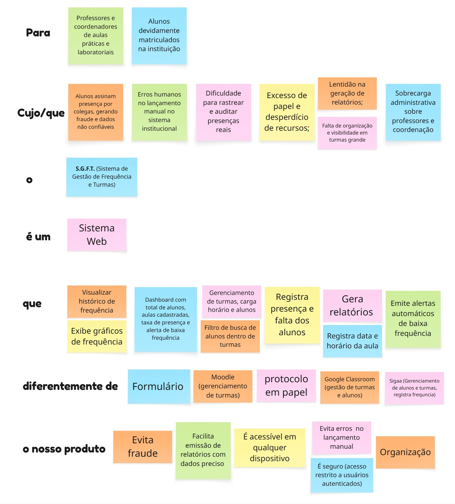

# Visão do Produto

## Introdução
Este documento apresenta a Visão do Produto do Sistema de Gestão de Presença Acadêmica desenvolvido pelo squad newtons, com o objetivo de estabelecer uma direção estratégica clara e compartilhada por toda a equipe antes do início do desenvolvimento. A visão de produto é um artefato fundamental na engenharia de software ágil, pois define de forma concisa o propósito do sistema, o público alvo, os problemas que resolve e o valor que entrega, funcionando como referência para todas as decisões de escopo, design e priorização ao longo do projeto.

## 1. Metodologia e Técnica Utilizada
A declaração da visão do produto foi construída utilizando a técnica do **Elevator Pitch** (Discurso de Elevador), um modelo de frase encadeada e estruturada originalmente popularizado por **Geoffrey A. Moore** em sua obra clássica *Crossing the Chasm* (1991). 

Essa abordagem foi adotada por ser uma prática consolidada no desenvolvimento ágil de software e em dinâmicas de *Product Discovery*. Ela força a equipe de desenvolvimento a sintetizar o propósito do sistema e a alinhar o entendimento macro do projeto antes do início de qualquer linha de código. A estrutura organiza-se através de blocos narrativos sequenciais que conectam as dores do cliente, os objetivos de negócio, o escopo técnico do produto e os seus diferenciais competitivos.

## 2. Artefato Visual (Quadro de Concepção)

Abaixo está o mapeamento visual colaborativo construído pela equipe para consolidar os blocos conceituais do sistema:

*Figura 1: Matriz de posicionamento estratégico do produto baseada no modelo de frase encadeada de Geoffrey A. Moore (1991), mapeando os segmentos de usuários (professores, coordenadores e alunos), as dores operacionais identificadas nos laboratórios acadêmicos, os requisitos centrais do sistema web e os fatores de diferenciação frente às soluções de mercado existentes.*

## 3. Como a Dinâmica foi Realizada
A elaboração deste artefato seguiu um fluxo dividido em quatro etapas principais:

1. **Identificação do Público e das Dores (Para / Cujo que):** Cruzamos as informações levantadas na reunião de consultoria inicial para mapear quem sofre com o processo atual (professores, coordenadores e alunos devidamente matriculados) e quais são os gargalos operacionais gerados pelo controle manual em papel (fraudes de assinatura, erros de digitação e lentidão em relatórios).
2. **Definição da Essência e Categoria (O / É um):** Estabelecemos o nome oficial da solução — **Sistema de Gestão de Presença** — e o categorizamos de forma precisa como um **Sistema Web Full Stack**.
3. **Mapeamento de Funcionalidades Chave (Que):** Listamos os módulos essenciais exigidos para resolver os problemas citados, incluindo o registro digital de presenças, dashboards analíticos com gráficos, geração instantânea de relatórios exportáveis e emissão automatizada de alertas de baixa frequência.
4. **Análise Competitiva e Diferenciais (Diferentemente de / O nosso produto):** Contrastamos a solução com as alternativas atuais (listas em papel, planilhas isoladas e formulários) e com os sistemas institucionais genéricos existentes (Moodle, Google Classroom, SUAP, Sigaa). A partir disso, definimos nossos pilares de valor: eliminação total de fraudes, segurança via autenticação rígida, organização centralizada de dados e acessibilidade multiplataforma para qualquer dispositivo.

## Histórico de Versões

| Versão | Data       | Descrição                                     | Autor                                                                                                                                                                                                                                                                                                      | Revisor                                               |
| ------ | ---------- | --------------------------------------------- | ---------------------------------------------------------------------------------------------------------------------------------------------------------------------------------------------------------------------------------------------------------------------------------------------------------- | ----------------------------------------------------- |
| 1.0    | 05/06/2026 | Documentação da visão de produto      |  [Geovanna Alves](https://github.com/GeovannaUmbelino) | [Felipe Serikava](https://github.com/felipeserikava-web)  e [Ronan Freitas](https://github.com/HunterBRR)|
